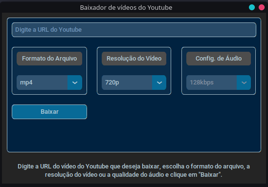

# YoutubeVideoDownload

<hr>

Programa feito em python usando a lib do pytubefix para baixar videos do Youtube,
e utiliza o CustomTkinter para gerar uma interface interativa para o usuário.



### Como instalar

Rode o comando:

```bash
pip install -r requirements.txt
```

Depois rode o comando:

```bash
python app.py
```